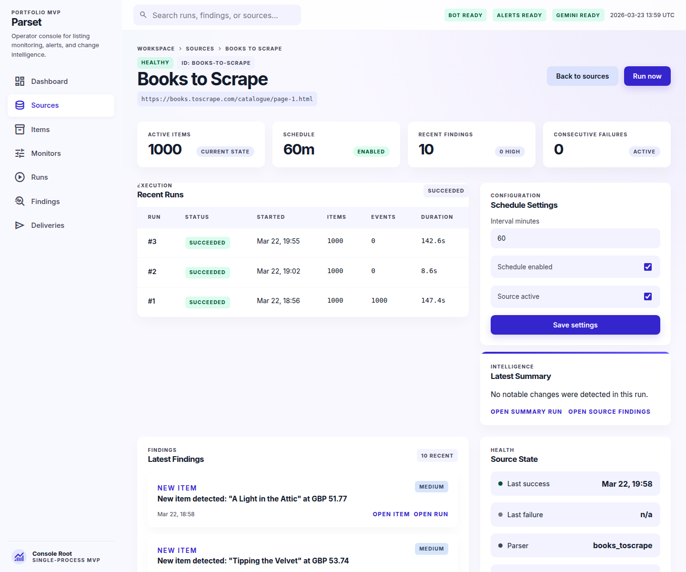
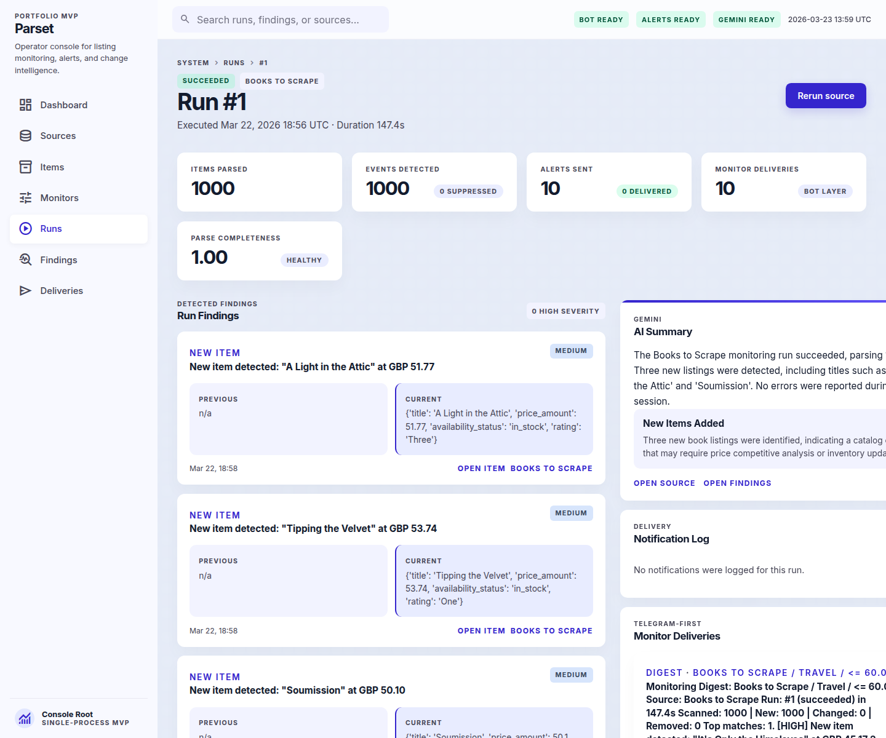
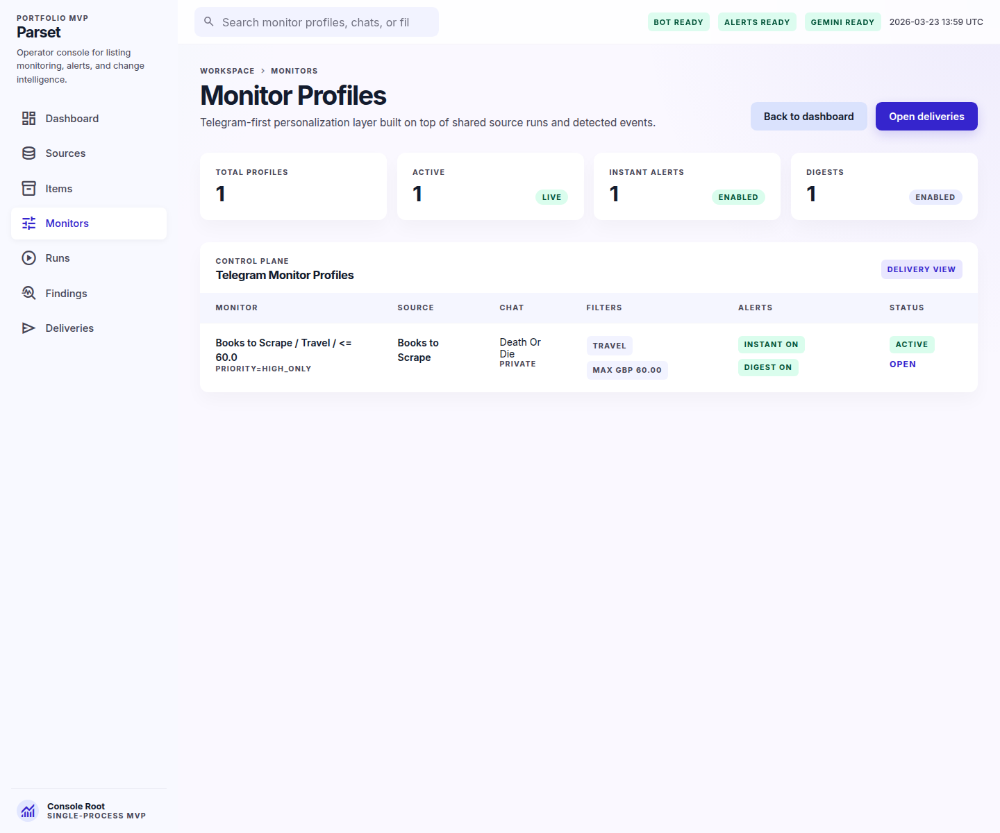
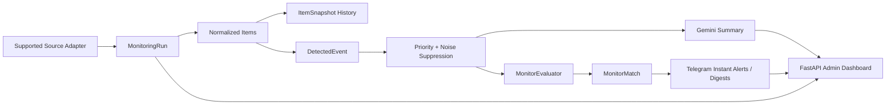

# Parset Monitor

Parset Monitor is a portfolio-ready MVP for intelligent product and listing monitoring. It parses supported sources, stores item state over time, detects meaningful changes, suppresses noise, matches findings against Telegram monitor profiles, sends alerts and digests, generates Gemini summaries, and exposes the whole workflow in a focused FastAPI operator console.

It is intentionally scoped like a real product:

- one shared source run instead of re-parsing per user
- deterministic change detection before AI
- Telegram as both delivery layer and control layer
- admin UI for ops and observability, not a generic scraper script page

Public demo bot:

- `@fhparserfh_bot` - available when the maintainer demo instance is online

## Product Showcase

| Overview dashboard | Source detail |
| --- | --- |
|  |  |
| Run detail | Telegram-first monitor profiles |
|  |  |

## How It Works

1. A supported source adapter fetches and parses the catalog.
2. Parsed listings are normalized into stable `Item` records and stored as `ItemSnapshot` history.
3. The diff engine creates `DetectedEvent` records for new items, removals, price changes, stock changes, and meaningful attribute updates.
4. Severity scoring, cooldown suppression, and source health rules turn raw diffs into actionable findings.
5. Gemini generates a short run summary, while the Telegram-first layer matches findings against `MonitorProfile` filters and sends instant alerts or digests.



## Telegram Output Examples

Instant alert example:

```text
[HIGH] Books to Scrape / Travel / <= 60.0
New item detected: "Neither Here nor There: Travels in Europe" at GBP 38.95
Why matched: category=Travel; price=38.95; event=new_item
Price: GBP 38.95
Category: Travel
Open item: https://books.toscrape.com/catalogue/neither-here-nor-there-travels-in-europe_198/index.html
```

Digest example:

```text
Monitoring Digest: Books to Scrape / Travel / <= 60.0
Source: Books to Scrape
Run: #1 (succeeded) in 147.4s
Scanned: 1000 | New: 1000 | Changed: 0 | Removed: 0
Top matches:
1. [HIGH] New item detected: "It's Only the Himalayas" at GBP 45.17
2. [HIGH] New item detected: "Full Moon over Noah's Ark: An Odyssey to Mount Ararat and Beyond" at GBP 49.43
3. [HIGH] New item detected: "See America: A Celebration of Our National Parks & Treasured Sites" at GBP 48.87
Gemini summary:
The Books to Scrape monitoring run succeeded, parsing 1,000 items. Three new listings were detected, including titles such as "A Light in the Attic" and "Soumission". No errors were reported during this session.
```

## Mini Case Study

This repo already demonstrates a realistic end-to-end monitoring story on the seeded `Books to Scrape` source:

- cold-start run parsed `1,000` items and created `1,000` structured `new_item` events
- Gemini generated a run summary instead of the AI layer being treated like a chatbot gimmick
- Telegram monitor profiles matched a filtered subset of findings and produced both instant alerts and a grouped digest
- cached category hydration reduced the warm benchmark run from roughly `147s` to `8.6s`

That mix of parser logic, state, filtering, delivery, and operator UX is the main portfolio value of the project.

## What This Project Demonstrates

- Stateful scraping, not just HTML parsing
- Deterministic change detection for new, removed, price, availability, and attribute events
- Source health evaluation with explicit `healthy`, `degraded`, and `failing` states
- Telegram integration as both a delivery channel and a bot-based control plane
- Gemini integration as a practical summarization layer on top of deterministic logic
- Server-rendered admin UI for runs, findings, monitor profiles, deliveries, and source health
- Offline HTML fixture coverage for parser regressions without relying on the live site
- Smoke coverage for admin pages and core API wiring via `TestClient`
- CI, linting, formatting, and Alembic migrations that make the MVP feel like a real backend product

## Stack

- Python 3.12
- FastAPI
- SQLAlchemy + SQLite
- Alembic
- APScheduler
- Requests + BeautifulSoup
- Telegram Bot API
- aiogram 3
- Gemini REST API

## Local Setup

```bash
python3 -m venv .venv
./.venv/bin/pip install -e '.[dev]'
cp .env.example .env
./.venv/bin/python -m alembic upgrade head
./.venv/bin/uvicorn app.main:app --reload
```

Open `http://127.0.0.1:8000/admin`.

If you want the Telegram bot control plane, set `TELEGRAM_BOT_CONTROL_ENABLED=true` before starting the app. Then open your bot in Telegram and send `/start`.

For the public demo and any local production-like run, keep the app single-process. Do not run it with multiple Uvicorn workers.

## Configuration

Core monitoring behavior is controlled from `.env`:

- `REMOVAL_MISS_THRESHOLD=2`
- `ALERT_COOLDOWN_HOURS=12`
- `MIN_ABSOLUTE_PRICE_DELTA=1.00`
- `MIN_PERCENT_PRICE_DELTA=2.0`
- `DEGRADED_PARSE_RATIO_THRESHOLD=0.70`
- `PARSER_DETAIL_FETCH_WORKERS=12`

Operational integrations are optional:

- `HTTP_RETRY_ATTEMPTS=3`
- `HTTP_RETRY_BASE_SECONDS=1.0`
- `TELEGRAM_BOT_TOKEN`
- `TELEGRAM_CHAT_ID`
- `TELEGRAM_BOT_CONTROL_ENABLED=false`
- `TELEGRAM_BOT_POLLING_TIMEOUT_SECONDS=30`
- `TELEGRAM_MESSAGE_CHUNK_SIZE=3500`
- `TELEGRAM_RETRY_ATTEMPTS=4`
- `TELEGRAM_RETRY_BASE_SECONDS=1.5`
- `GEMINI_API_KEY`
- `GEMINI_MODEL`
- `ADMIN_READ_ONLY_MODE=false`

If Telegram is not configured, notifications are logged as `skipped`. If Gemini is not configured, the app stores a deterministic fallback summary instead of failing the run.

For a public demo, set `ADMIN_READ_ONLY_MODE=true` to keep the dashboard browsable while blocking manual runs and source edits without adding a full auth system.

## Database Migrations

Schema changes are managed through Alembic rather than runtime `create_all()`.

```bash
./.venv/bin/python -m alembic upgrade head
```

When you evolve the schema locally:

```bash
./.venv/bin/python -m alembic revision --autogenerate -m "describe change"
./.venv/bin/python -m alembic upgrade head
```

If you already have a local `data/app.db` from the pre-Alembic version of the project, either:

- delete it and run `./.venv/bin/python -m alembic upgrade head`, or
- back it up and mark it as already migrated with `./.venv/bin/python -m alembic stamp head`

## Product Behavior

- First successful run seeds the catalog and creates `new_item` events.
- The first run is the most expensive because it warms category attributes for the source; repeat runs reuse cached attributes and are much faster.
- Repeat runs with no change produce zero new events.
- Removed items are emitted only after the configured number of healthy consecutive misses.
- Degraded runs suppress removals to avoid false positives on suspicious crawls.
- Run locking is intentionally single-process and in-memory for this MVP.
- Supported source parsing is shared at the platform layer. User personalization happens through `MonitorProfile` matching, not per-user re-parsing.

## Execution Model And Locking

- `SourceRunLockManager` is intentionally in-memory and single-process.
- Background admin runs, scheduler jobs, and Telegram-triggered runs are coordinated correctly only inside one app process.
- For the public demo, run a single Uvicorn process and do not use `--workers > 1`.
- If the project later moves to multi-worker or multi-host deployment, the lock should move to a shared coordination layer such as the database or Redis.

## Telegram-First Layer

The monitoring core stays source-centric:

```text
Source -> MonitoringRun -> Item / ItemSnapshot -> DetectedEvent
```

The Telegram-first product layer sits on top:

```text
TelegramUser / TelegramChat -> MonitorProfile -> MonitorMatch -> NotificationDelivery
```

This means:

- a supported source is parsed once per run
- detected events are matched against all active monitor profiles for that source
- instant alerts and digests are delivered per monitor profile and per chat
- the Telegram bot acts as the control plane, while the FastAPI dashboard remains the ops/admin surface

Current bot flows:

- `/start`
- `Create monitor`
- `My monitors`
- `Notifications`
- `Run check`
- `Status`

## Project Structure

```text
app/
  api/           FastAPI routes for admin pages and JSON endpoints
  bot/           aiogram control-plane handlers and FSM state
  core/          settings, DB, logging, scheduler, time helpers
  models/        SQLAlchemy models
  parsers/       source adapters
  repositories/  DB access layer
  services/      runner, diffing, health, suppression, Telegram, Gemini, monitor matching
  web/           templates and static assets
tests/           parser, diff, runner, notifier, evaluator, Gemini, and smoke tests
docs/            README screenshots
```

## Testing

```bash
./.venv/bin/python -m pytest
```

## Quality Checks

```bash
./.venv/bin/python -m ruff check .
./.venv/bin/python -m ruff format --check .
./.venv/bin/python -m pytest
```

GitHub Actions runs the same lint + test pipeline on every push and pull request.

## Pre-commit

```bash
./.venv/bin/python -m pre_commit install
./.venv/bin/python -m pre_commit run --all-files
```

The project keeps the local quality stack intentionally small:

- `ruff check` for linting and import sorting
- `ruff format` for consistent formatting
- `pre-commit` to run both before each commit

## Roadmap

- add more supported source adapters without opening arbitrary URL onboarding in v1
- add richer digest views and per-monitor history in the bot
- add export/report views for findings and delivery outcomes
- optionally move from single-process scheduling to a worker-backed deployment model

## Notes

- The first source adapter targets `Books to Scrape`, which is safe and stable for portfolio demos.
- The architecture is ready for additional supported adapters without pretending to support any arbitrary site from day one.
- This MVP is single-process by design, so `SourceRunLockManager` is documented as runtime-only locking rather than a distributed lock system.
